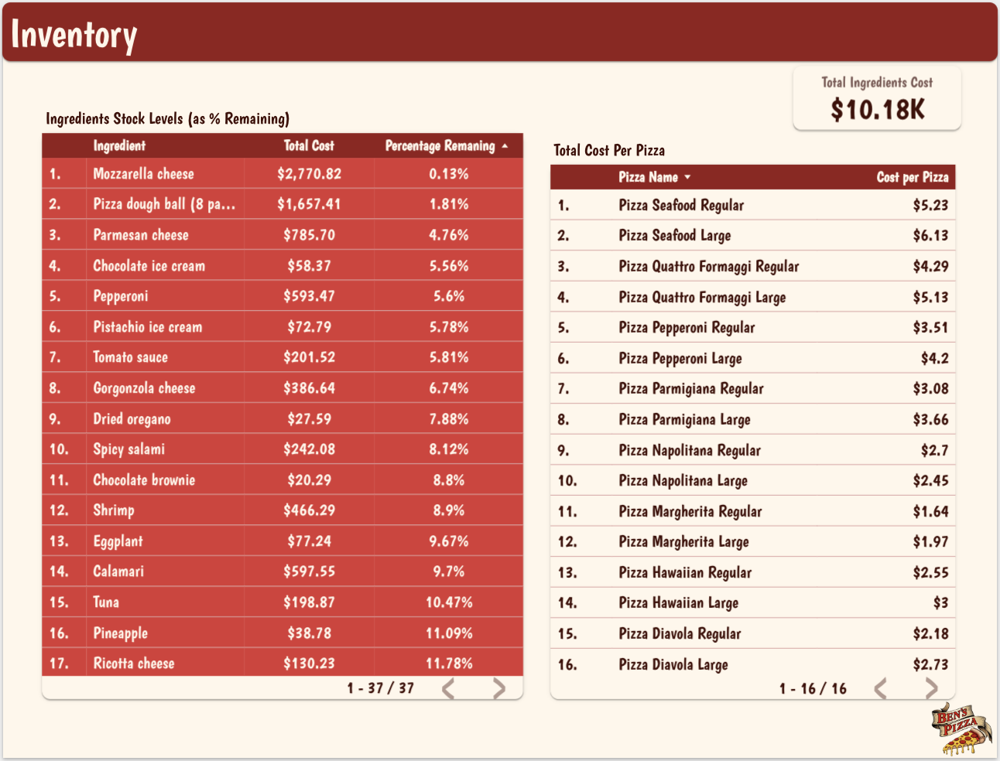

# Ben's Pizza 🍕🍕

## Meet Ben, the Owner

  
  

Ben is the proud owner of **Ben's Pizza**, a local favorite known for its delicious wood-fired pizzas and warm atmosphere. As part of his commitment to improving his business, Ben has asked us to analyze some key aspects of the pizzeria’s operations during January 2023.

## Ben's Request

Ben has tasked us with analyzing various data points to help him make informed decisions about his pizzeria. He wants to know:

1. **Which items are the most popular** on the menu and how they correlate with customer orders.
2. **How much inventory** of each ingredient is used during the week and whether Ben needs to adjust his supply levels.
3. **Staff performance analysis**, looking at how shifts are scheduled and whether labor costs align with business needs.

## The Menu

Ben has an extensive menu with pizzas, sides, and drinks that are loved by the community. Below is the **menu** that we will be analyzing for business insights:

  

The menu offers a wide variety of pizzas with different sizes, toppings, and prices. Our analysis will help Ben understand which items are performing well and which might need adjustments based on customer preferences.

## Orders Analysis

- **Objectives**: Identify best-selling pizzas and top items on the menu.

  

-**Analysis**:

## Inventory Analysis

**Objectives**: Identify which ingredients should be purchased soon, and what pizzas cost the most to make based on ingredient prices.

  

-**Analysis**:
 
## Staff Analysis

**Scheduling**: Analyze staff cost and overall shift performance based on sales amounts.

  
  

-**Analysis**:

## Loading the data from the csv files to the database

If you encounter "LOAD DATA INFILE ERROR: but as of v2.0 you must provide streamFactory option returning ReadStream." when trying to load your data to your database, [check out this post i made on loading CSV files into MySQL using node.js](https://medium.com/@zinebknch/a-comprehensive-guide-to-loading-csv-data-into-mysql-using-node-js-0379b74ee59d). 
I hope it helps!
