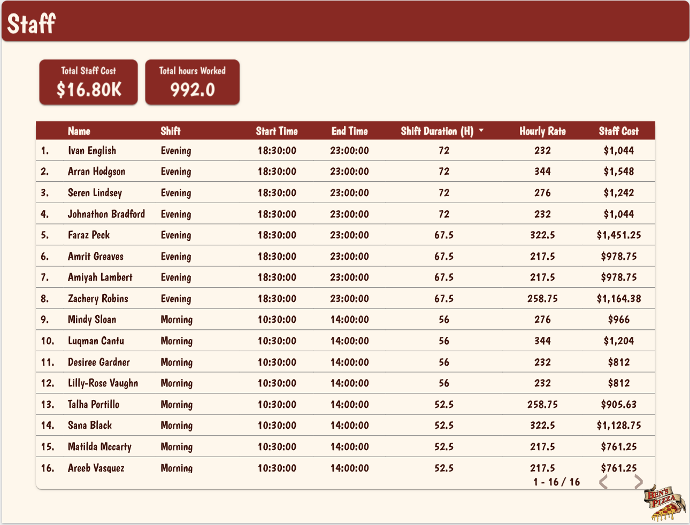
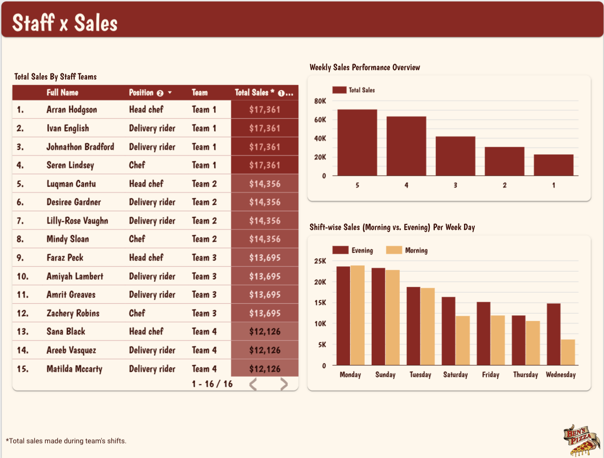

# Ben's Pizza 🍕🍕

## Meet Ben, the Owner

  
  

Ben is the proud owner of **Ben's Pizza**, a local favorite known for its delicious wood-fired pizzas and warm atmosphere. As part of his commitment to improving his business, Ben has asked us to analyze some key aspects of the pizzeria’s operations during January 2023.

## Ben's Request

Ben has tasked us with analyzing various data points to help him make informed decisions about his pizzeria. He wants to know:

1. **Which items are the most popular** on the menu and how they correlate with customer orders.
2. **How much inventory** of each ingredient is used during the week and whether Ben needs to adjust his supply levels.
3. **Staff performance analysis**, looking at how shifts are scheduled and whether labor costs align with business needs.

## The Menu

Ben has an extensive menu with pizzas, sides, and drinks that are loved by the community. Below is the **menu** that we will be analyzing for business insights:

  

The menu offers a wide variety of pizzas with different sizes, toppings, and prices. Our analysis will help Ben understand which items are performing well and which might need adjustments based on customer preferences.

Access the project's dashboard [here](https://lookerstudio.google.com/reporting/8d58b36e-e4e1-4be9-a444-95ed966ca5ad)!
The SQL queries for setting up the schema can be found [here](SQL_files/schema_setup.sql)
The SQL queries used to create the views needed for the dashboard can be found [here](SQL_files/tables_needed.sql). 

P.S.: I created some new views, and will add their queries later.

## Orders Analysis

**Objectives**: Identify best-selling pizzas and regions with the highest order numbers.

  

**Analysis**:
1. **Overall Performance:**
   - A total orders number of 1,091 with total sales of $57.54K indicates a healthy revenue stream for January 2023.
2. **High-Performing Items:**
   - Pizza Diavola Large and Pizza Napolitana Large dominate sales, likely due to their popularity and high margins.
Seafood pizzas (large and regular) and Quattro Formaggi also perform well.

3. **District Performance:**
   - Manhattan is the top-performing district, contributing significantly to overall sales.
   - Other districts, such as Staten Island and Queens, have room for growth.
    
4. **Peak Hours:**
   -Sales peak around 11 PM to 1 PM during lunchtime and again at 7 PM to 10e PM during dinner. This consistent pattern indicates that consumers are most likely to make purchases during their lunch breaks and after-work hours.
     
4. **Delivery:**
   - 60.2% of customers prefer delivery, indicating a heavy reliance on logistics and delivery services.

**Recommendations for Ben:**
1. **Capitalize on Top Performers:**
   - Focus marketing efforts on highly performing pizzas like Pizza Diavola and Napolitana, offering combo deals or limited-time promotions to increase sales.
     
2. **Expand in Low-Performing Districts:**
   - Launch targeted campaigns and promotions in Staten Island, Queens, and Brooklyn to boost visibility and sales.
   - Partner with delivery platforms or local businesses to increase market penetration.
     
3. **Address Afternoon Sales Dip:**
   - Introduce afternoon specials or happy hour deals to encourage orders during off-peak hours (2 PM - 5 PM).
   - Bundle lower-demand pizzas with beverages or sides to attract budget-conscious customers.
     
4. **Enhance Delivery Operations:**
   - Offer delivery incentives, such as discounts for first-time customers or free delivery above a certain order value.
     
5. **Leverage Manhattan’s Strength:**
   - Introduce a loyalty program in Manhattan to retain existing customers and further boost sales.
  
## Inventory Analysis

**Objectives**: 
- Identify which ingredients need to be replenished urgently to maintain smooth pizza production.
- Highlight the most expensive pizzas to make and analyze their profitability.

  

  

**Analysis**:
  1. **Ingredients Running Low:**
  - 22 ingredients have less than 15% of their stock remaining, including mozzarella, pizza dough, and tomato sauce—key ingredients used in most pizzas.
  - Without replenishment, production of high-demand pizzas like Margherita and Pepperoni could be disrupted.
    
  2. **High-Cost Ingredients:**
  - Mozzarella cheese and pizza dough are the most expensive ingredients, primarily because they are essential for every pizza.
  - Seafood toppings (used in Seafood pizza) and the different kinds of cheeses (used in Quattro Formaggi) are also among the most expensive.

  3. **Most Expensive Pizzas to Make:**
  - The Seafood Pizza and Quattro Formaggi Pizza have the highest production costs but remain profitable, as their selling price is more than three times their cost.

**Recommendations**:
1. **Restock Critical Ingredients:**  
   - Ben, the owner, should immediately replenish mozzarella, pizza dough, and tomato sauce to prevent disruptions in pizza production.  
   - Set reorder thresholds at **25% of stock for high-usage ingredients** so restocking occurs automatically before supplies run too low.  

2. **Monitor Ingredient Costs:**  
   - Ben should negotiate better pricing with suppliers on high-cost items like mozzarella and seafood. For example, ordering in bulk could lower the unit price.  
   - Compare prices from multiple suppliers for specialty cheeses to find the most cost-effective option without compromising quality.  

3. **Optimize Inventory Tracking:**  
   - Ben should conduct monthly inventory audits** to avoid errors in stock levels and better forecast future ingredient demand.  
   - Consider automating inventory tracking to receive alerts when ingredients fall below a certain threshold.  

4. **Promote High-Profit Pizzas:**  
   - Ben should focus on marketing the Seafood Pizza and Quattro Formaggi Pizza more aggressively** since they have high profit margins despite their production costs.  
   - Highlight these pizzas with “premium” labels or offer limited-time promotions to drive demand.  

 
## Staff Analysis

**Scheduling**: Analyze staff cost and overall shift performance based on sales amounts.

  

  

  
**Analysis**:
- Summary:
The staff performance and cost analysis for Ben’s Pizza reveal a total staff cost of $16.80K for 992 hours worked across morning and evening shifts. The sales generated during these shifts totaled $57.54K, with Team 1 outperforming other teams. The data underscores the need to balance staffing costs with sales contribution, optimize shift assignments, and identify underperforming roles or time slots.

1. **Staff Costs:**
   - Total Staff Cost: $16.80K for a total of 992 hours worked.
   - Evening shifts account for the highest expenses due to longer shift durations and higher hourly rates.
   - Faraz Peck, with a shift cost of $1,452.15, is the highest-paid employee, reflecting their extended shift hours and high hourly rate.
     
2. **Shift Analysis:**
   - Morning Shift: Lower cost due to shorter hours (maximum of 56 hours per shift).
   - Evening Shift: Higher cost due to longer hours (67.5 to 72 hours per shift).

3. **Sales Performance by Staff Teams:**
   - Top Performer: Team 1, generating $17.85K in total sales for the month, led by Arran Hodgson.
   - Team 4 lags behind, contributing the least to total sales.
     
4. **Shift vs. Day Performance:**
   - Sales peak during evening shifts, indicating higher customer traffic during dinner hours.
   - Monday and Sunday generate the highest revenue, while Wednesday sees the lowest sales, suggesting an opportunity to optimize operations midweek.

**Recommendations for Ben:**
1. **Optimize Staffing Costs:**
   - Reevaluate the distribution of high-cost evening shifts. Explore rotating evening roles to reduce individual staff expenses.
   - Analyze whether high-cost staff like Faraz Peck and Stan Black contribute proportionally to the sales they generate.
     
2. **Boost Midweek Sales:**
   - Introduce targeted midweek promotions or discounts to attract more customers on slower days like Wednesday and Thursday.
   - Offer staff incentives during low-performing shifts to boost morale and productivity.
     
3. **Balance Team Performance:**
   - Investigate the reasons behind Team 4’s lower performance. Provide additional support, such as skill development or adjusting roles, to improve their contribution.
   - Leverage insights from high-performing teams like Team 1 to replicate their success across other groups.

   
## Loading the data from the csv files to the database

If you encounter "LOAD DATA INFILE ERROR: but as of v2.0 you must provide streamFactory option returning ReadStream." when trying to load your data to your database, [check out this post i made on loading CSV files into MySQL using node.js](https://medium.com/@zinebknch/a-comprehensive-guide-to-loading-csv-data-into-mysql-using-node-js-0379b74ee59d). 
I hope it helps!
